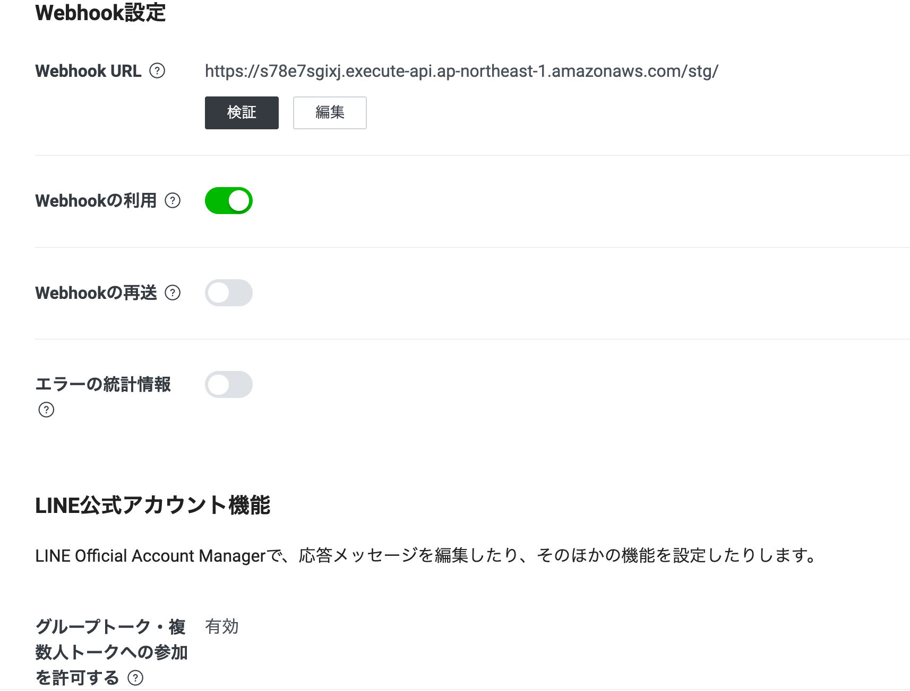

# line-slideshow-backend
LINEから画像を受け取り、スライドショーを表示するツールのバックエンド。
画像を受け取りS3にアップロード、およびスライドショーの作成を行う。

# LINE Messaging API
画像を送る入口部分。
作成はここを参照：https://zenn.dev/kou_pg_0131/articles/line-push-text-message

# AWS CLIの準備
AWS CLIをインストールしておく。
https://docs.aws.amazon.com/ja_jp/cli/latest/userguide/cli-chap-install.html


# デプロイ方法
```shellscript
$ cd ./aws
$ sh deploy-xxx.sh # xxxは環境名
```

# デプロイ後の設定
## S3
以下のファイルを格納する。
- /resources
    - Boom.mp3
    - endroll1.mp4
    - endroll2.mp4
    - endroll3.mp4
    - list1.txt
    - list2.txt
    - NotoSansJP-Bold.ttf
### ローカル実行の場合
以下のコマンドで一括アップロードできる。(環境変数がstgになっているので注意！)
```shellscript
$ cd ./aws/S3
$ sh upload.sh
```

## Secrets Manager
以下のキーを設定する。
- ACCESS_TOKEN : LINEから取得したアクセストークン
- CHANNEL_TOKEN : LINEから取得したチャンネルトークン

## LINE
API GatewayのエンドポイントをLINEのWebhookに設定する。


## フロントエンドアプリのデプロイ
フロントエンドのリポジトリREADMEを参照。